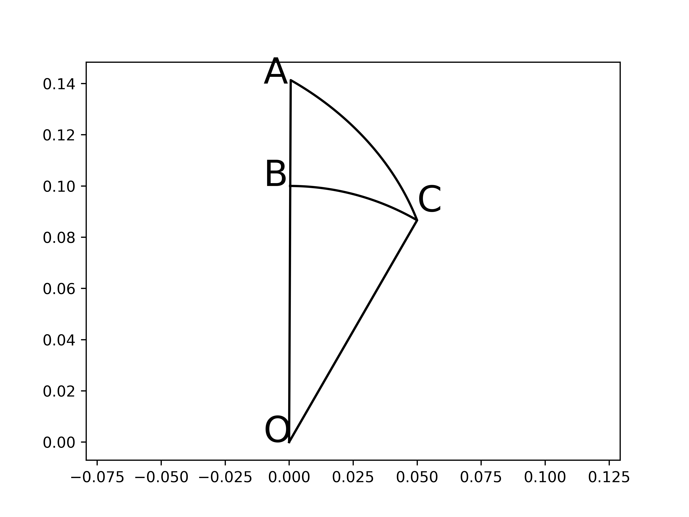
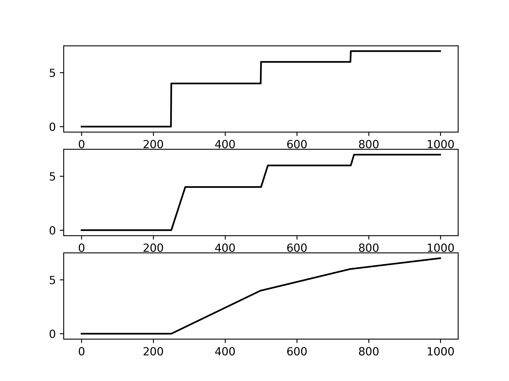

# Trajectory Generator for Magnetic Resonance Imaging

## Abstract
This project includes:
1. A python package `mrtrajgen`.
1. An example `Example.py`

## Introduction
This is a project for generating desired trajectories for Magnetic Resonance Imaging. Just for personal use and test.

## Theory
### Fixed Slew Rate Spiral
See `proof.py`

### Fixed Interval Spiral

Assuming $C$ is an arbitraty known point on the spiral, $A$ is the next point we want to derive. $AC$ is a segment of the spiral. $OB$ equals to $OC$.\
Let's assume $\angle BOC = \Delta\theta$, $OC = \rho$, $AB = \Delta\rho$, and $\Delta\rho = r\Delta\theta$.\
When $\Delta\theta \rarr 0$, $BC$ can be considered a segment, and $\angle ABC \rarr 90\deg$, we can further derived that: $AB^2 + BC^2 = AC^2$ and $AC$ is usually the Nyquist interval we want to achieve, alias $d_k$.\
Based on the above assumption ($\Delta\theta\rarr0$), we can derive the following equation:
$$
(r\Delta\theta)^2+(\rho\Delta\theta)^2=d_k^2
$$
Solving the aboved equation we can get:
$$
\Delta\theta=\frac{d_k}{\sqrt{r^2+\rho^2}}
$$
Since this equation is based on the assumption that $\Delta\theta \rarr 0$, the greater the $\Delta\theta$, the greater the error. The maximum of error achieved at the 3rd point of spiral:
1. The 1st point can be manually set to $\rho=0$, $\theta=0$.
1. The 2nd point can be manually set to $\rho=d_k$, $\theta=2\pi$
1. The 3rd point will be calculated by the above equation, the worst situation achieves when $r = 0$, and $\Delta\theta=\pi/3$, the derived value of $\Delta\theta$ is $1$. Thus the maximum error is $\frac{\pi}{3}-1$.

### Gradient derivation
When calculating gradient array according to trajectory, the ramping process of gradient system could be one of 3 possibilities:
1. The slew rate is infinate.
1. The slew rate is finate and always maximum.
1. The slew rate is finate and always minimum.

Here we give out the gradient derivation under assumption 2:\
Assuming the sampling interval is $t$, the gradient amplitude of ideal case is $G$, and the gradient amplitude under assumption 2 at initial state is $G_0$, the target gradient amplitude is $G_1$, the slew rate (quotient of $\Delta G$ and $\Delta t$) is $R$. We can derive the following equation:
$$
G_1t\pm\frac{1}{2}\Delta G\Delta t=Gt
$$
Thus:
$$
G_1t\pm\frac{1}{2}(G_1-G_0)\frac{G_1-G_0}{R}=Gt
$$
if $G>G_0$, $-$ is selected for $\pm$, if $G<G_0$, $+$ is selected for $\pm$.\
So we can define: $s=sign(G_0-G)$.\
Then we can get:
$$
G_1t+\frac{s}{2}(G_1-G_0)\frac{G_1-G_0}{R}=Gt
$$
Finally we can derive the following quadratic equation:
$$
G_1^2 + (\frac{2Rt}{s}-2G_0)G_1+(G_0^2-\frac{2GtR}{s})=0
$$
by soloving which, we can get:
$$
G_1=G_0-\frac{Rt}{s}\pm\sqrt{(\frac{Rt}{s}-G_0)^2-(G_0^2-\frac{2GtR}{s})}
$$

### Slew Rate Calculation on a Circle
slew rate in assumption 3 can be calculated by the differential coefficient of $G(t)$:
$$
k(t)=\gamma\int G(t)dt\\
\frac{dG(t)}{dt}=\frac{1}{\gamma}\frac{d^2k(t)}{dt^2}
$$
since
$$
k(t)=[k_x(t), k_y(t)]\\
k_x(t)=\rho cos(\omega t)\\
\omega=\frac{2\pi}{\frac{2\pi\rho}{d}\Delta t}\\
k_x(t)=\rho cos(\frac{d}{\rho\Delta t} t)\\
$$
where $\rho$ is the radius of trajectory, $d$ is the sampling interval in k-space ($\frac{2\pi\rho}{d}$ is the number of points at circle with radius of $\rho$), $\Delta t$ is the temporal interval between two sampling points.\
We can then derive
$$
|\frac{d^2k(t)}{dt^2}|=max|\frac{d^2k_x(t)}{dt^2}|=\rho(\frac{d}{\rho\Delta t})^2\\
|\frac{dG(t)}{dt}|=\frac{1}{\gamma}|\frac{d^2k(t)}{dt^2}|=\frac{d^2}{\gamma\rho\Delta t^2}
$$